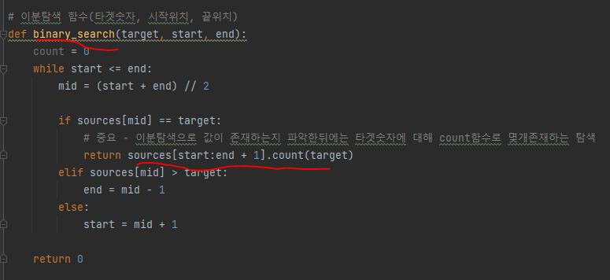
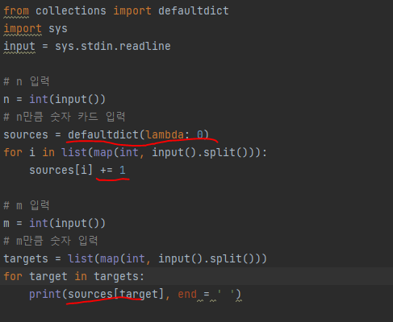

# 문제 유형
- 이분탐색
  - 탐색 범위가 넓기 때문에 이분탐색 사용
- defaultdict
  - hash 자료구조를 사용해 해결하는 방식이 제일 빠르지만 이분탐색 연습하기 위해 2가지 유형으로 풀었음

# 주요 코드 개념
- 이분탐색 풀이
  - 시간초과를 해결하기 위해 2가지 방법 필요함
    1. 이분탐색을 통해 타겟숫자가 존재하는지 파악
       - 존재한다면 count 함수를 통해 전체 개수 계산

          
    
    2. 이미 계산한 타겟숫자를 또다시 계산하지 않도록 dictionary 사용해 검사

          
      

- defaultdict 사용하는 방식이 제일 빠름

  

# 시간복잡도
- O(N)이나 O(logN)