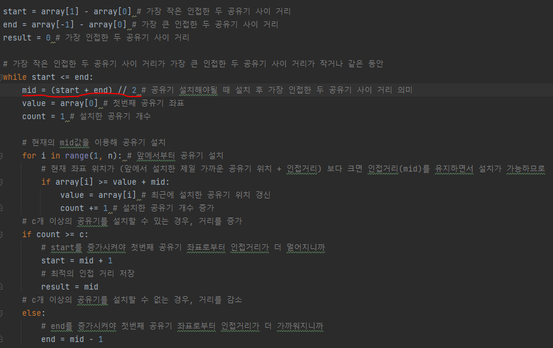
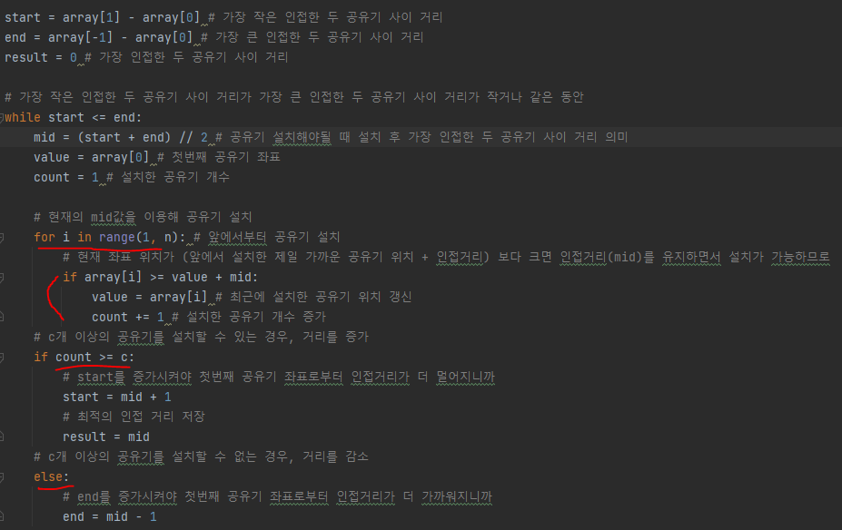
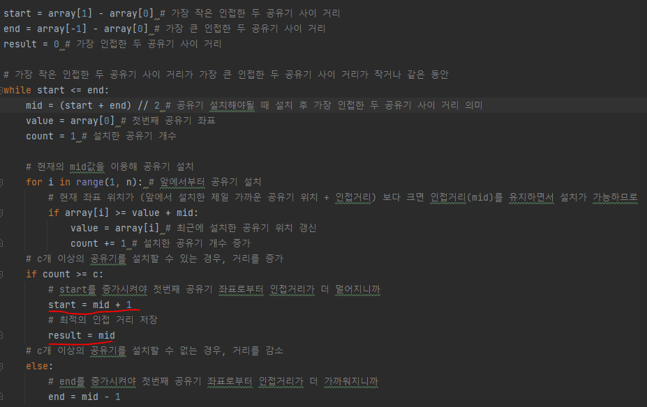

# 문제 유형
- 이진 탐색
  - 집에 설치하는 가장 인접한 두 공유기 사이의 거리의 최댓값을 탐색하는 문제 
    - 각 집의 좌표가 최대 10억(탐색범위가 10억) 이므로, 시간 초과를 방지하기 위해 이진 탐색 이용
  - 파라메트릭 서치 유형 

# 주요 코드 개념
- 이진 탐색으로 가장 인접한 두 공유기 사이의 거리를 조절하면서
  
  

- 매 순간 실제로 공유기를 설치하여 C보다 많은 개수로 공유기를 설치할 수 있는지 체크

  

- C보다 많은 개수로 공유기를 설치할 수 있다면 '가장 인접한 두 공유기 사이의 거리'값을 증가시켜, 더 큰 값에 대해서도 성립하는지 체크하기 위해 다시 탐색 수행
  
  

# 시간복잡도