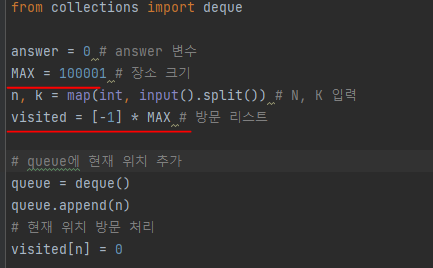
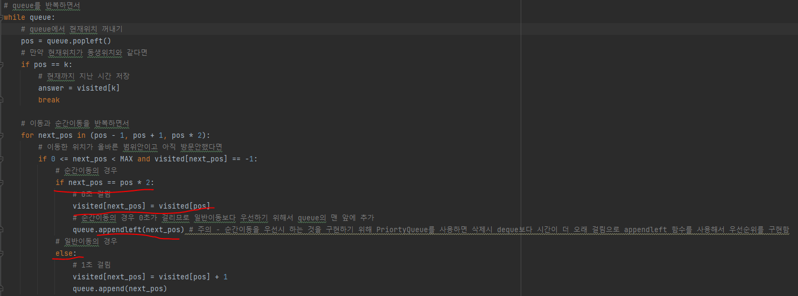
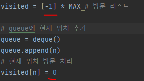
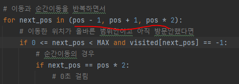

# 문제 유형
- BFS
  - 시작 위치에서 목적지 위치까지 도달할 수 있는 가장 빠른 시간을 구하는 문제이므로 BFS 사용

# 주요 코드 개념
- 방문 리스트
  - 방문 여부 확인 및 시작위치에서 특정 위치까지 걸린 시간 저장하기 위해 사용
  
    

- 순간이동의 경우와 아닌 경우 따로 처리
  - 순간이동의 경우 0초가 걸리므로 일반이동보다 우선처리를 하기 위해서 PriorityQueue를 사용하는 대신 deque를 사용하면서 큐에 맨앞에 올수있도록 appendleft 사용
  
    
  
# 주의 코드 개념
- 방문 리스트
  - -1 : 방문안함
  - 0 : 방문함
  
  

- 연산 반복시 다음과 같이 코드 작성하기

  

# 시간복잡도 
