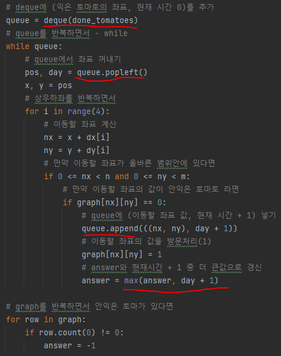
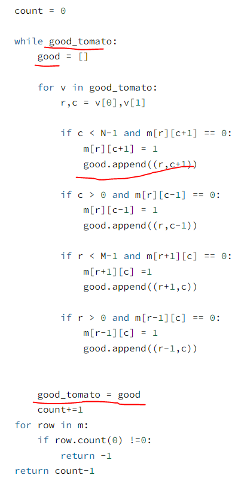

# 문제 유형 
- BFS
  - 토마토가 모두 익을 때까지의 최소 날짜를 출력하는 문제이기 때문에 최소 비용(거리)를 구하는 BFS를 사용해야함 

# 주의 코드 개념 
- queue에 넣고 빼는 방법보다는 리스트에 넣고 초기화하는 방법이 시간이 더 적게 걸림 
  - queue에 넣고 빼는 방법
    
    

  - 리스트에 넣고 초기화하는 방법
  
    

