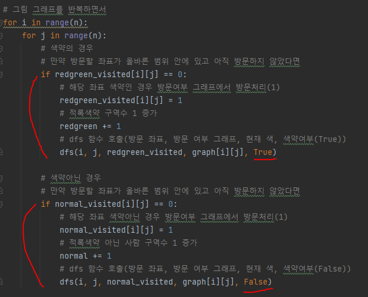
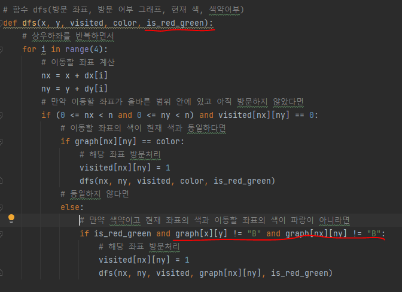
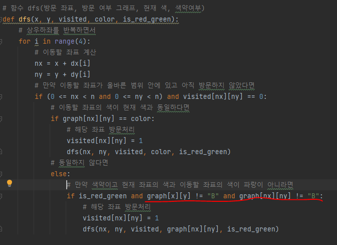

# 문제 유형
- DFS or BFS
  - 상하좌우로 인접한 구역을 같은 구역으로 판단하고 구역의 개수를 세는 문제이기 때문에 DFS 또는 BFS 사용

# 주요 코드 개념
- 색약인 경우와 색약이 아닌 경우로 방문 그래프를 나누어 처리

  

  

# 주의 코드 개념
- 색약의 경우 빨강과 녹색을 동일하게 처리하는 경우 주의

  

# 시간복잡도