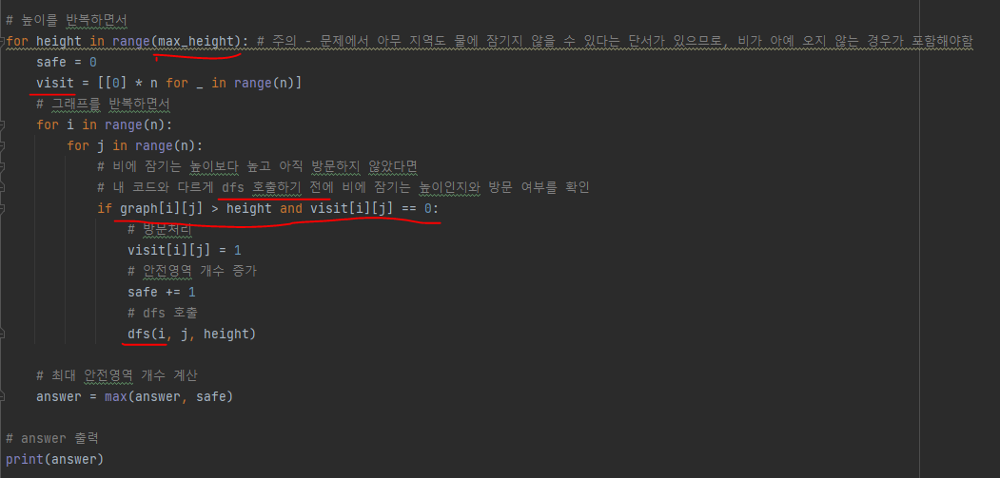
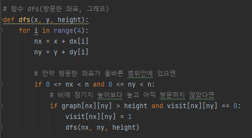
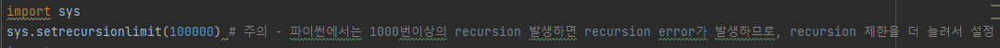
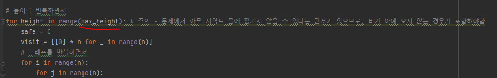

# 문제 유형
- DFS 또는 BFS
  - 주어진 그래프에서 인접한 영역이 비와 잠기는지 잠기지 않는 지를 확인하면서 안전한 영역의 최대 개수를 계산하는 문제이기 때문
# 주요 코드 개념
- 비의 높이에 따른 각 안전영역 개수를 구하고 최대 안정영역 개수를 구함

    

- dfs 함수 호출

    
    
# 주의 코드 개념
- recursion error 해결하기 위해, recursion 제한 더 늘리기

    

- 문제에서 아무 지역도 물에 잠기지 않을 수 있다는 단서가 있으므로, 비가 아예 오지 않는 경우가 포함해야함

    

# 시간단축

# 시간복잡도
- O(N^3)
- 시간 단축
  - DFS 방식의 경우 함수 호출로 걸리는 시간이 있다보니 함수 호출을 보다 적게 할 수 있도록 DFS 호출 이전에 방문조건을 먼저 확인해 아예 호출 안하는 편이 시간 단축이 됨 
  - graph를 deepcopy하기 보다는 visit 그래프를 만들어서 해당 그래프로 방문 여부 확인하기