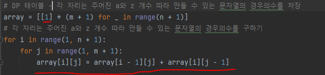
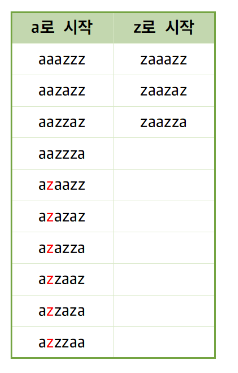
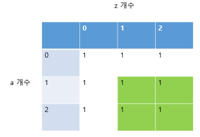
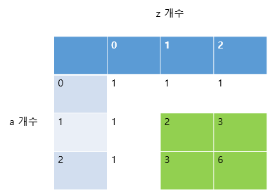
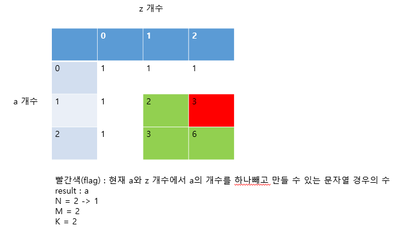
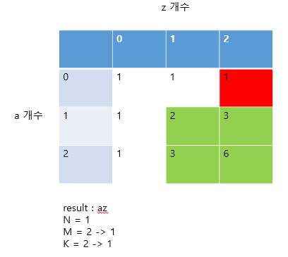
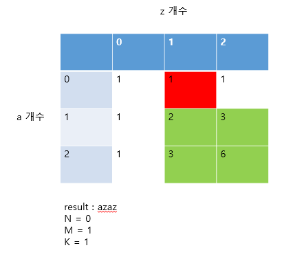

# 문제 유형 
- Dynamic Programming
  - 주어진 a와 z로 만들 수 있는 문자열 중에서 K번째 문자열이 무엇인지 구하는 문제
  - 조합을 사용해서만 풀면 중복연산 때문에 시간 초과남으로 DP 사용해서 풀어야함

# 주요 코드 개념
- DP 테이블
  
  

- flag 
  
  
  
  - flag를 사용하면서 앞에서부터 문자를 확정시키면서 진행해야함
  - n = 3, m = 3, k = 6 인 경우,  첫번째 문자열이 a로 시작하는 문자열의 개수는 10개(=permu[2][3])이므로 문자열의 첫번째 자리는 a로 확정지을수 있다. 그 다음 두번째 문자열이 a로 시작하는 문자열의 개수는 4개(=permu[1][3])뿐이므로 두번째 자리는 z인 것을 알 수 있다. 두번째 자리를 z로 확정지으면서 두번째 자리가 a인 문자열의 개수만큼을 뛰어넘었으므로 k를 4(=두번째 자리가 a인 문자열의 개수)만큼 감소시킴

- 진행예시 (n = 2, m = 2, k = 2, 답 : azaz)
  - DP 테이블 초기화

    

  - DP 테이블 a와 z가 주어진 개수에 따라 만들 수 있는 문자열 경우의 수 계산

    

  - flag 사용하며 계산 진행

    
  
    

    

    

# 주의 코드 개념
- DP 문제에서 문자열이 나오는 경우네는 DP 테이블을 2차원으로 만들 생각을 하고 문제 풀기

# 시간복잡도