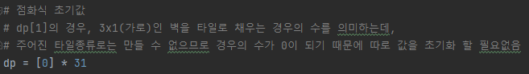
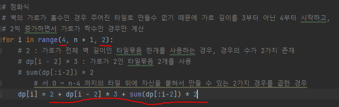
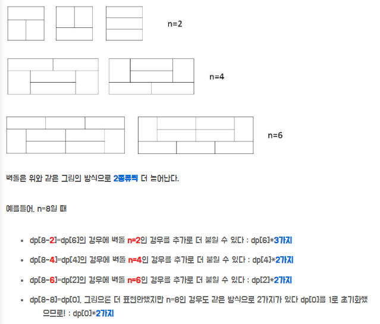
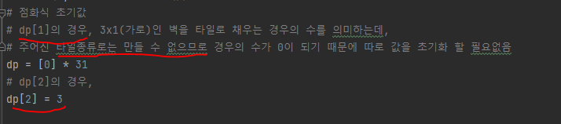

# 문제 유형 
- Dynamic Programming
  - 타일 채우기 유형 
    - 벽에 대해, 주어진 타일 종류로 채울 수 있는 경우의 수를 구하는 문제

# 주요 코드 개념
- dp 테이블
  - 주어진 가로 길이의 벽에 대해 타일 종류로 채울 수 있는 경우의 수 저장
    
        
  
- 점화식
    
  
  - 2 : 가로가 전체 벽 길이인 타일묶음 한개를 사용하는 경우, 경우의 수가 2가지 존재
  - dp[i - 2] * 3 : 가로가 2인 타일묶음 2개를 사용
  - sum(dp[:i-2]) * 2
    - 0 ~ n-4 까지의 타일 뒤에 자신을 붙혀서 만들 수 있는 2가지 경우를 곱한 경우
  - 예를 들어 N이 8인 경우
    
    
    
  - 점화식 초기값

    

# 주의 코드 개념
- dp 테이블 크기를 31로 하지않고 n + 1하면 indexerror 발생
  
# 시간복잡도