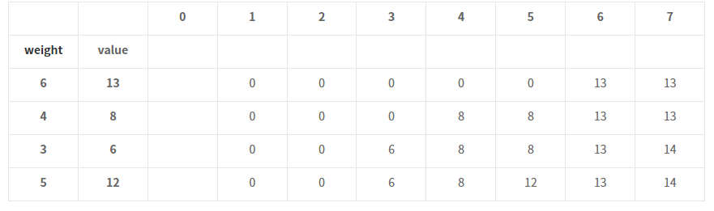
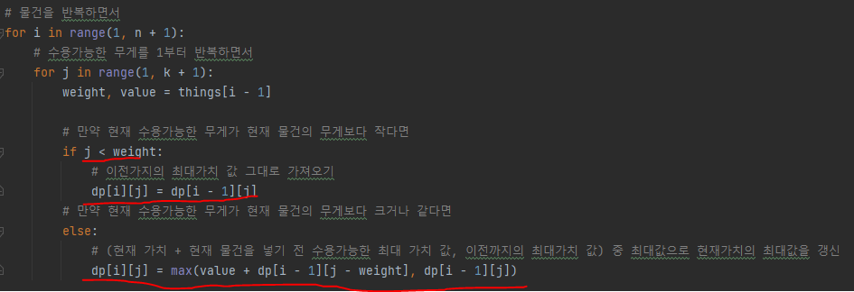

# 문제 유형
- Dynamic Programming
    - Knapsack(배낭) 알고리즘 
      - 도둑이 훔치는 배낭에 담을 수 있는 물건 무게의 최댓값이 정해져 있고, 일정 가치와 무게가 있는 짐들을 배낭에 넣을 때, 물건 가치의 합이 최대가 되도록 짐을 고르는 방법을 찾는 문제
    - Knapsack(배낭) 알고리즘 종류
      - 담을 수 있는 물건이 나눌 수 있냐 없냐에 따라 나뉨
        - 물건이 나누어질 때(설탕 몇 g 등)
          - 분할가능 배낭문제
        - 물건이 나누어질 수 없을 때(담는다 or 안담는다)
          - 0-1 배낭문제
    - 점화식
      - 현재 최대 가치 = max(현재 가치 + 현재 물건을 넣기 전 수용가능한 최대 가치 값, 이전까지의 최대가치 값)

# 주요 코드 개념
- 2차원 dp 테이블
  - 각 수용무게에 따른 수용가능한 최대 가치를 저장
    
    

- 점화식
  - 현재 최대 가치 = max(현재 가치 + 현재 물건을 넣기 전 수용가능한 최대 가치 값, 이전까지의 최대가치 값)

    

# 시간복잡도 