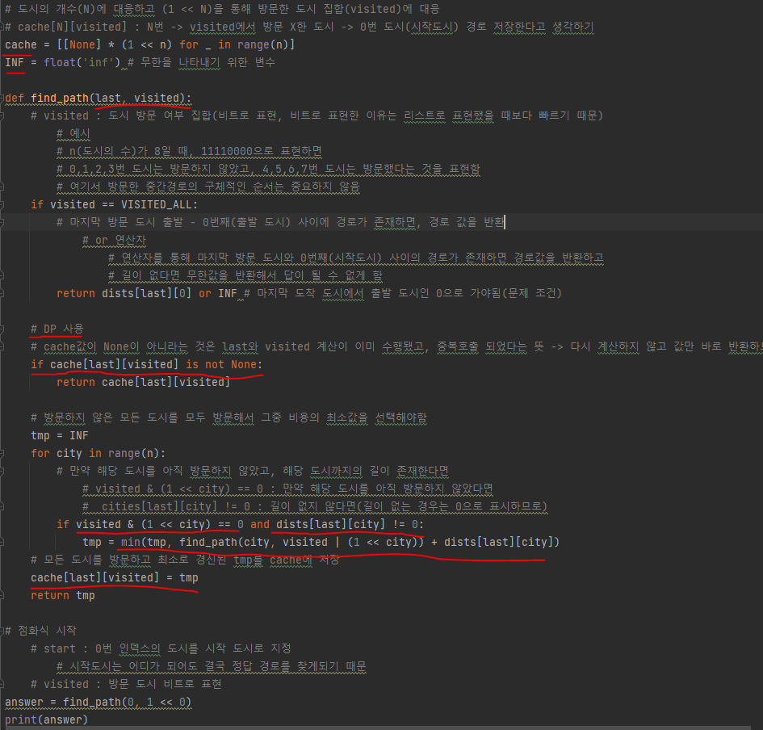
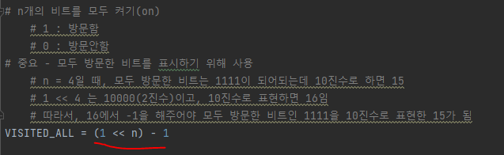
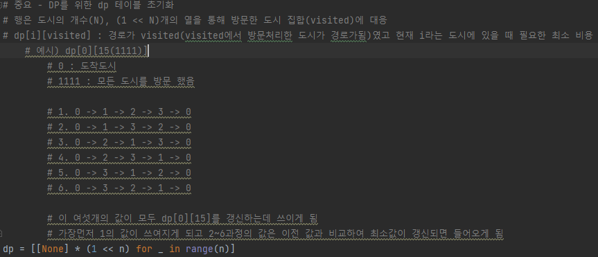
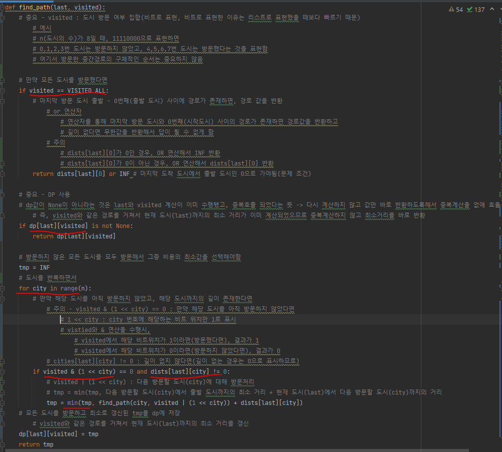

# 문제 유형
- Dynamic Programming
  - TSP(Travelling Salesman Problem) 유형 문제
    - 외판원의 순회에 필요한 최소 비용을 구하는 문제 
    - 완전탐색방식으로 풀 경우 N이 큰 경우 시간초과 발생하므로 DP를 적용해 풀어야함
    - 또한 다음과 같은 요소를 통해 시간복잡도를 좀 더 줄임
      - 방문여부를 비트연산으로 처리
- 비트마스크
  - 비트마스크를 사용해 방문 여부를 표현함
# 주요 코드 개념
- 완전탐색 방식
  - 각 도시에서 출발해서 다른 모든 도시를 차례로 방문하고 모든 도시를 방문했으면 해당 경로의 비용과 지금까지 찾은 중간해중 최소값을 택해 나가는 방식으
    
    

- Dynamic Programming 적용 방식
  
  

  - 사전 전제
    - 시작도시는 중요하지 않음 
      - 문제의 조건 중 한번 방문한 도시는 재방문 하지 않는 다는 조건 때문
        - 즉 방문하는 경로는 Cycle이라는 의미이고, Cycle인 경우에는 시작점이 중요하지 않게됨
        - 결국, 시작점을 단일 도시로 고정해도 정답 경로를 지나치게 되므로 시작 도시를 추적하지 않아도 됨
        - 완점탐색방식의 find_path(start, last, visited, tmp_dist)에서 start 생략 가능
      - 따라서, 시간복잡도과 다음과 같이 바뀔수 있음 
        - O(N^2 * 2^N) -> O(N * 2^N)
    - 구체적인 경로는 중요하지 않음
    - 특정 start, last, V에서 이들을 활용한 find_path(start, last, V) 가 실제 중복 호출되는지 확인해야 함
      - 완전탐색방식의 find_path(start, last, visited, tmp_dist)에서 tmp_dist 생략 가능
    - 방문여부 비트로 표현해 비트연산 수행

    - 비트마스크를 사용해 방문여부 표현
        - 0000 : 방문 아예 안함
        - 0101 : 1번째 도시와 3번째 도시 방문
        - 1111 : 모든 도시 방문
    
        

    - dp테이블
      - 최소 비용으로 저장하기 위해 사용 
      - dp[i][visited] : 경로가 visited(visited에서 방문처리한 도시가 경로가됨)였고 현재 i라는 도시에 있을 때 필요한 최소 비용을 의미

        

    - 재귀함수로 최소 비용 계산

            
    
# 주의 코드 개념
- 비트연산
  - 1 << n 
    - 1을 비트로 바꾸고, 비트기준에서 왼쪽으로 n번 이동
  - (1 << n) - 1

    
  