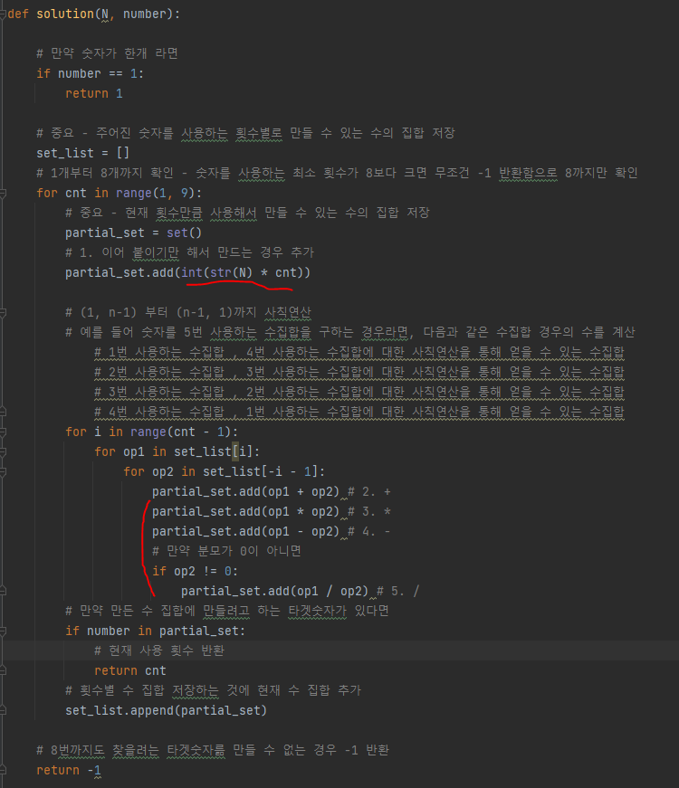

# 문제 유형 
- DP
  - N과 사칙연산만 사용해서 표현할 수 있는 방법 중 N 사용횟수의 최솟값 반환

# 주요 코드 개념
- 주어진 숫자를 사용하는 횟수별 만들 수 있는 수의 집합을 저장하며 수 집합 만들기
  - 수 집합을 만들 때 다음 경우의 수를 통해 수집합 만듬
    1. 이어붙이기만 해서 만드는 경우
    2. 사칙연산(4가지)

  