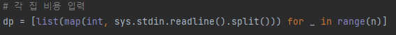
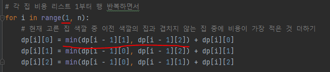

# 문제 유형
- Dynamic Programming
  - 규칙을 만족하면서 모든 집을 칠하는 비용의 최솟값을 구하는 문제
  - 시간제한이 0.5로 짧기 때문에 이전에 했던 연산을 다시하지 않고 저장한 값을 이용해야 하기 때문에 DP로 풀어야함
  - 점화식
    - 현재 고른 집 색깔 중 이전 색깔의 집과 겹치지 않는 집 중에 비용이 가장 적은 것 더하기
    
# 주요 코드 개념
- dp 테이블

    

- 점화식

  

# 시간복잡도
- O(n)