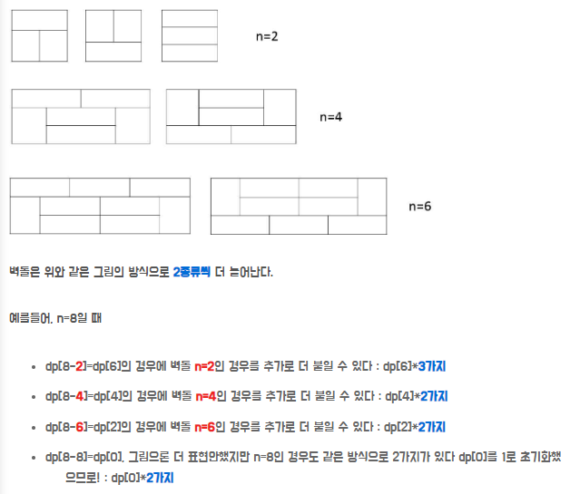

# 문제 유형 
- Dynamic Programming
  - 타일 채우기 유형 
    - 벽에 대해, 주어진 타일 종류로 채울 수 있는 경우의 수를 구하는 문제

# 주요 코드 개념
- dp 테이블
  - 주어진 가로 길이의 벽에 대해 타일 종류로 채울 수 있는 경우의 수 저장
  
- 점화식
    
  
  - 2
    - 가로가 짝수배로 늘어날 때마다, 새로운 경우의 수가 2가지씩 늘어나기 때문에 더해주는 경우의 수
      - 예를 들어, 가로가 4일 때, 가로가 2인 경우 만들 수 있는 경우의 수로 가로 4를 채울 수 있지만, 만들 수 있는 2개의 새로운 형태가 생김
        - 이런식으로, 계속 새로운 형태가 2가지씩 늘어남
  - dp[i - 2] * 3
    - 가로가 2칸 남아있을 때 만들 수 있는 경우의 수가 3가지 이므로, 2칸 남아있을 때 까지의 경우의 수 * 3
  - sum(dp[:i-2]) * 2
    - 0 ~ n-4 까지의 타일 뒤에 자신을 붙혀서 만들 수 있는 2가지 경우를 곱한 경우
      - 즉, 가로가 2칸 남아있을 때를 제외하고는 이외의 경우(가로가 4칸, 가로가 6칸.. 남아있는 경우)는 한번에 채울 수 있는 경우의 수가 모두 2가지 이므로 ,sum으로 묶어서 계산
  - 예를 들어 N이 8인 경우
    
    
    
  - 점화식 초기값

    

# 주의 코드 개념
- dp 테이블 크기를 31로 하지않고 n + 1하면 indexerror 발생
  
# 시간복잡도