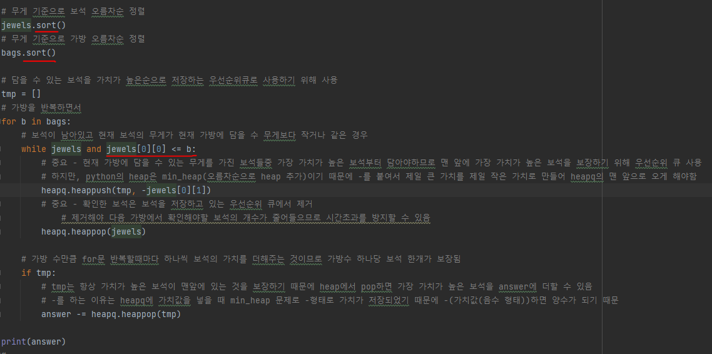
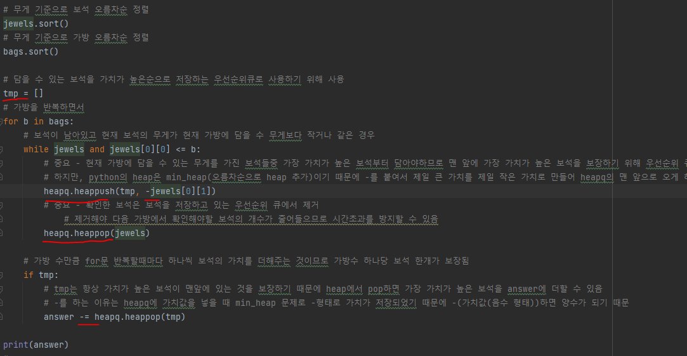

# 문제 유형
- Greedy
  - 훔칠 수 있는 보석의 최대 가격을 구하는 문제
  - 최적해 방안
    - 가방이 수용하는 무게가 아무리 커도 가방 1개에는 보석 1개만 담을 수 있으므로, 보석과 가방을 오름차순 정렬해서, 가방에 보석을 넣을때마다 가장 적은 무게를 수용하는 가방으로 가장 가격이 높은 보석을 담으면 됨

# 주요 코드 개념
- 보석과 가방을 모두 무게 기준으로 오름차순 정렬
  - 이후 코드에서 수용가능한 무게가 작은 가방부터 보석을 담을 때 자기가 수용할 수 있는 보석(수용가능한 무게보다 작거나 같은 보석)은 보석큐(확인해야할 보석들)에서 제거해야하는데
  - 이를 위해서는 이후에 보석들은 무게가 높아서 수용이 절대 안되기 때문에 확인할 필요가 없다는 것을 보장해야되므로 정렬을 수행함

  

- 우선순위 큐 사용
  - 매 가방을 반복하면서 보석 한개를 담을 시에 가장 가치가 높은 보석 먼저 담아야 하므로 담을 수 있는 보석들이 가치순으로 정렬된 것을 보장하기 위해 우선순위 큐 사용
  - python은 min_heap이므로 가장 가치가 높은 가치가 맨 앞에 오기 위해 -를 붙여서 값을 저장
  - (중요) 확인한 보석은 보석을 저장하고 있는 우선순위 큐에서 제거
    - 제거해야 다음 가방에서 확인해야할 보석의 개수가 줄어들으므로 시간초과를 방지할 수 있음
  
  

# 시간복잡도