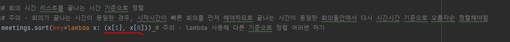
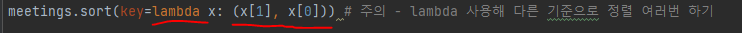

# 문제 유형 
- Greedy
  - 주어진 회의들에 대해 겹치지 않게 하면서 최대한 많은 회의를 진행할 수 있도록 하는 문제 
  - 최적해 방안에 따라 시간이 겹치지 않게 회의를 추가하면 되므로 그리디 문제임 
  - 최적해 방안
    - 회의를 제일 많이 열기 위해서는 빨리 회의가 끝나는 시간이 빠른 순서대로 회의실을 사용하면 됨

# 주요 코드 개념
- 회의 시간이 저장된 리스트를 두번 정렬해야함
  - 회의가 끝나는 시간 기준으로 오름차순 정렬
  - 회의 끝나는 시간이 동일한 회의들에 대해 다시 오름차순 정렬
    - 회의가 끝나는 시간이 동일한 경우, 시작시간이 빠른 회의를 먼저 해야함

    
  
# 주의 코드 개념
- 입력 처리 속도 때문에 input() 대신 sys.stdin.readline() 사용해야함

- 입력 tuple형태로 바로 받기

  

- lambda 사용해 다른 기준으로 정렬 여러번 하기
  
  

# 시간복잡도