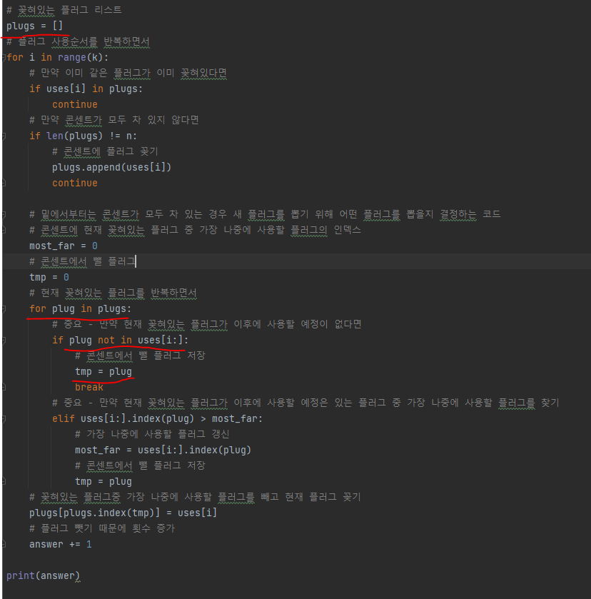
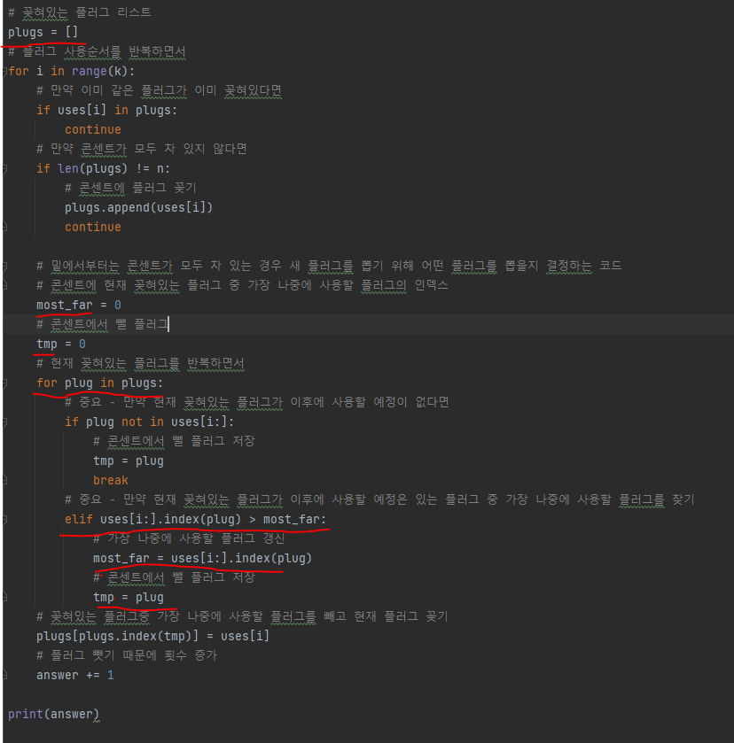
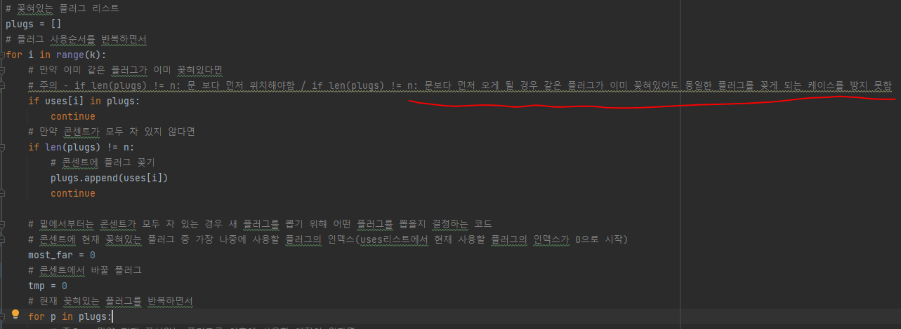

# 문제 유형
- Greedy
  - 하나씩 플러그를 빼는 최소 횟수를 구하는 문제
  - 최적해 방안
    - 플러그가 모두 꽂혀있을 때 새 전기용품이 들어오는 경우 꽂혀있는 플러그중 다음 기준을 우선적으로 뽑기 때문에 그리디 문제
      1. 앞으로 사용할 플러그가 아닌 경우
      2. 앞으로 사용한다면 가장 멀리 있는 플러그인 경우

# 주요 코드 개념
- 플러그가 모두 꽂혀있을 때 새 전기용품이 들어오는 경우 꽂혀있는 플러그중 우선적으로 뽑는 기준에 대한 코드
  - 1. 앞으로 사용할 플러그가 아닌 경우

    

   2. 앞으로 사용한다면 가장 멀리 있는 플러그인 경우

    

# 주의 코드 개념
- if문 순서 주의

  

# 시간복잡도