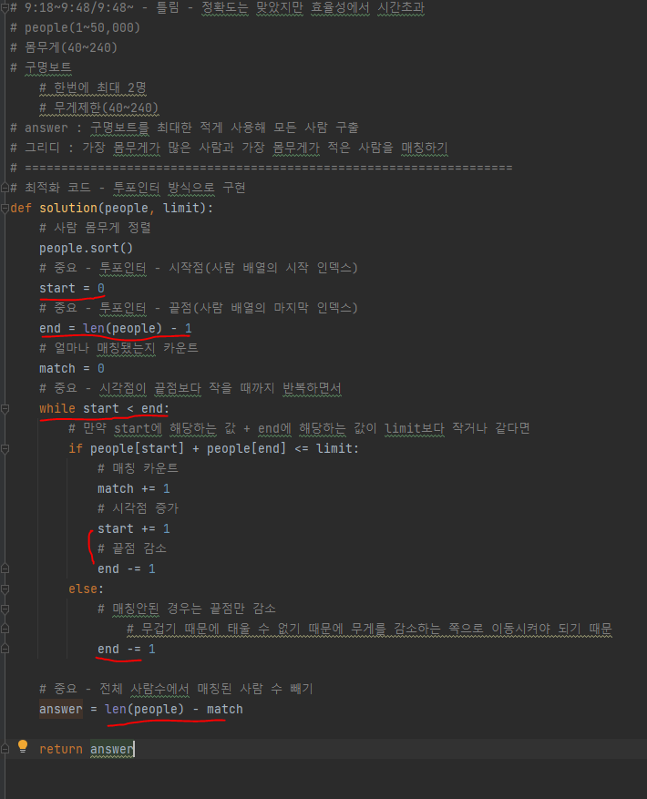

# 문제 유형 
- 그리디
  - 모든 사람 구출하는데 필요한 구명보트 이동 횟수 
  - 아이디어
    - 가장 몸무게가 많은 사람과 가장 몸무게가 적은 사람을 매칭

# 주요 코드 개념
- 오름차순으로 몸무게 정렬
- 투포인터 방식으로 구현
  - 시작점(현재 남아있는 사람중 몸무게가 가장 적은 사람)과 끝점(현재 남아있는 사람중 몸무게가 가장 많은 사람)

  

  