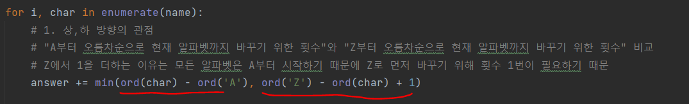
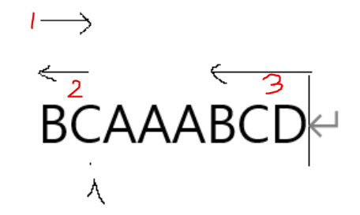
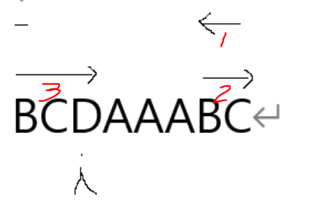
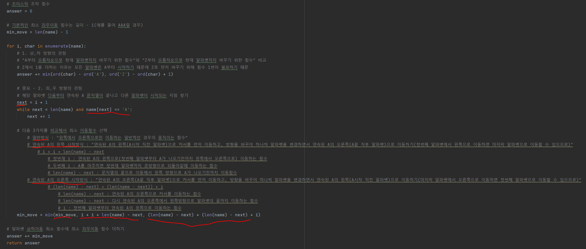

# 문제 유형
- 그리디
  - 연속되는 A가 있을 때, 그것의 왼쪽이나 오른쪽부터 시작하며 알파벳을 변경하는 방법이 효율적이라는 아이디어를 통해 해결하는 문제
  - 아이디어
    - 연속되는 A의 최대 길이 중요
      - 연속되는 A가 있는 곳에는 굳이 갈 필요가 없으므로, 그 부분을 제외하고 수정하는 경우만 계산
      - 다만, 연속되는 A가 여러군데인 경우 가장 긴 부분을 안가는게 더 효율적
        - 예를 들어, JAAJAAAAJ 인 경우 4번째 J를 처리하기 위해서 2, 3번째의 연속된 AA를 건너는게 5,6,7,8번쨰의 연속된 AAAA를 건너는 것 보다 나음
  
# 주요 코드
- 이동횟수에는 2가지 종류가 있음 
  - 알파벳을 바꾸는 횟수(상,하 방향 관점) 
  - 커서를 이동하는 횟수(좌,우 방향 관점)

- 상,하 방향 이동횟수 계산

    

- 좌, 우 방향 이동횟수 계산
  - 먼저, 연속된 A 문자열이 끝나고 다른 알파벳이 시작되는 지점 찾기 
  - 일반방식, 연속된 A의 왼쪽에서 시작하는 방식, 연속된 A의 오른쪽에서 시작하는 방식 중 최소 이동횟수를 선택
    - 연속된 A의 왼쪽에서 시작하는 방식
        
    - 연속된 A의 오른쪽에서 시작하는 방식
        
  
      
