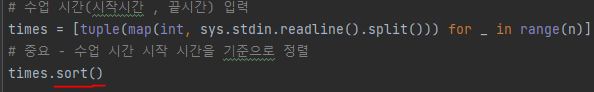
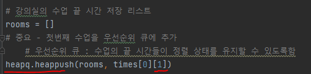
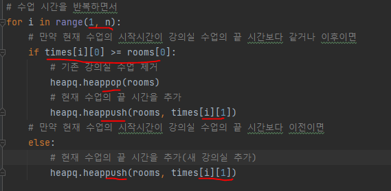
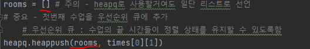

# 문제 유형 
- Greedy
  - 최소의 강의실을 사용해서 모든 수업을 가능하게 하는 문제이기 때문에 최적해 방안을 사용해 그때마다 강의실 추가할지 말지 결정하므로 그리디 유형
  - 최적해 방안
    - 수업 시작시간 기준으로 정렬하면, 현재 수업이 이전 수업보다 늦게 시작하는 것이 보장되고, 이를 기준으로 수업이 끝났는지만 비교하면서 강의실을 추가할지 말지 결정

# 주요 코드 개념
- 주어진 수업 시간들을 시작 시간 기준으로 오름차순 정렬

  

- 우선순위 큐를 사용해 강의실에서 진행되는 수업의 끝 시간들을 저장

  

- 현재 수업의 시작시간과 강의실 수업의 끝 시간을 비교해 강의실 추가할지 말지 판단
  - heapq의 첫번째 강의실 끝시간만 확인하고 새로 강의실을 추가하는 이유는, 새로운 강의가 첫번째 강의실 끝시간보다 빨리 시작하면 heapq의 이후 강의실 시간은 첫번째 강의실 시간보다 늦게 끝나기 때문에 어차피 안되기 때문에 확인할 필요 없음 

    

# 주의 코드 개념
- heapq 선언 방법

  

# 시간복잡도