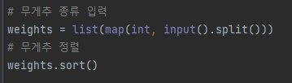
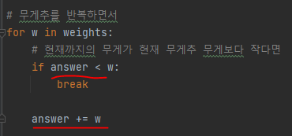

# 문제 유형
- Greedy
  - 주어진 무게추를 사용해 측정할 수 없는 양의 정수 무게 중 최솟값 구하는 문제
  - 최적해 방안
    - 무게종류를 오름차순으로 정렬하여, 작은 무게부터 그리디하게 더하면서 해당 무게가 측정이 가능한지 확인
    - 설명
      - N : 무게추 개수
      - K : 지금까지의 무게추를 조합해서 측정할 수 있는 최대 무게(1~K 까지의 모든 무게를 측정할 수 있다는 의미)
      - 예시
        - [1,1,2]의 무게추가 주어졌을 경우
          - 무게추를 이용해 측정할 수 있는 무게 : 1,2,3,4 -> K = 4
          - 만약 무게가 3인 새로운 무게추가 추가된다면(기존 K보다 무게가 작은 무게추 일 경우)
            - 새로운 K(측정할 수 있는 최대 무게) = 기존 K(기존에 측정할 수 있었던 최대 무게) + 새로운 무게추의 무게 
              - 숫자로 설명하면 
                - 기존 K가 4이기 때문에 1~4까지의 모든 무게를 측정할 수 있다는 의미이고, 그럼 1부터 4까지의 모든 무게마다 새로운 무게추를 더했을 때 측정할 수 있는 무게들은 다음과 같음
                  - 1 + 3 = 4
                  - 2 + 3 = 5
                  - 3 + 3 = 6
                  - 4 + 3 = 7
                - 무게추를 이용해 측정할 수 있는 무게에 기존의 1,2,3,4에서 새롭게 측정할 수 있는 무게 5,6,7이 추가됨
                  - 7이 새롭게 측정할 수 있는 최대 무게이니 기존 K(4) + 새로운 무게추의 무게(3)와 동일하므로 위의 식이 증명됨 
        - 근데 만약 무게가 5인 새로운 무게추가 추가된다면(기존 K보다 무게가 큰 무게추 일 경우)
          - 기존 K가 4였으므로 
            - 1 + 5 = 6
            - 2 + 5 = 7
            - 3 + 5 = 8
            - 4 + 5 = 9
          - 무게추를 이용해 측정할 수 있는 무게에 1,2,3,4에 새롭게 측정할 수 잇는 무게 6,7,8,9가 추가됨
            - 하지만, 중간에 5가 빠졌으므로 무게 5는 측정못하므로 측정할 수 없는 최소값이 5가 됨
      - 결론
        - 새롭게 추가되는 무게추의 무게가 K보다 클 경우, 다음이 성립 
          - 측정할 수 없는 최소값 = K + 1 

# 주요 코드 개념
- 시작 무게를 1부터 시작해야함

  

- 무게추 정렬 

  

- 현재까지의 무게가 현재 무게추 무게보다 작다면 현재까지의 무게는 측정 불가한 무게 

  

# 시간복잡도
- O(n)