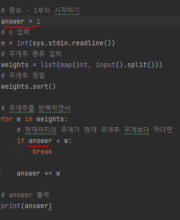
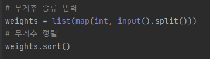
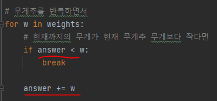

# 문제 유형
- Greedy
  - 주어진 무게추를 사용해 측정할 수 없는 양의 정수 무게 중 최솟값 구하는 문제
  - 최적해 방안
    - 무게종류를 오름차순으로 정렬하여, 작은 무게부터 그리디하게 더하면서 해당 무게가 측정이 가능한지 확인

# 주요 코드 개념
- 시작 무게를 1부터 시작해야함

  

- 무게추 정렬 

  

- 현재까지의 무게가 현재 무게추 무게보다 작다면 현재까지의 무게는 측정 불가한 무게 

  

# 시간복잡도