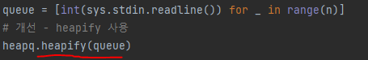

# 문제 유형 
- Greedy
  - 각 묶음의 카드를 합칠 때 필요한 비교횟수의 최솟값을 구하는 문제
  - 최적해방안 
    - 카드 묶음이 수가 많은 묶음을 합치는 행위를 최대한 적게 해야하므로, 카드수를 기준으로 오름차순 정렬한다음 그리디하게 순서대로 합치기
# 주요 코드 개념
- 우선순위 큐 사용
  - 묶을 때마다 항상 카드 수가 가장 적은 묶음끼리 묶어야 되므로, 큐에 맨앞에 항상 가장 적은 카드수를 보장하기 위해
  
    

# 시간복잡도