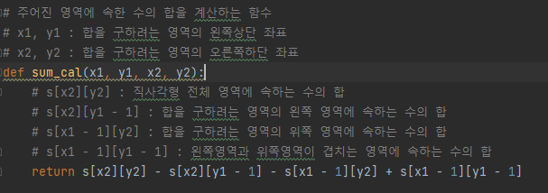
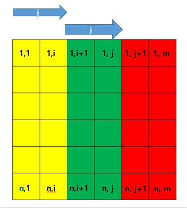
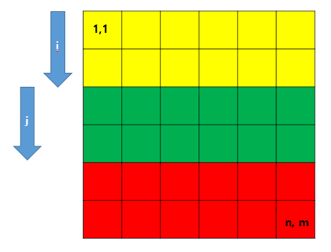
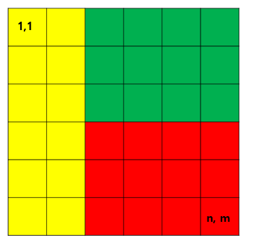
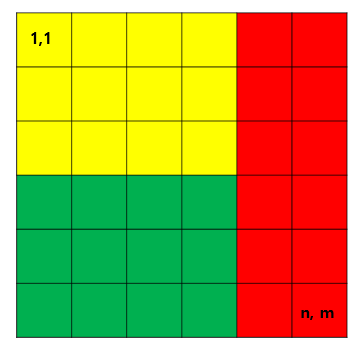
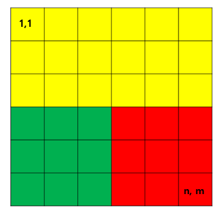
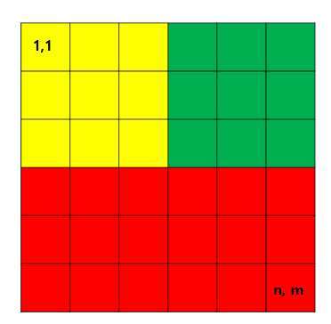

# 문제 유형
- 완전탐색
  - 주어진 직사각형을 3개로 나누었을 때 각각 작은 직사각형 합의 곱의 최댓값을 구하는 문제이므로, 3개의 직사각형을 만드는 경우의 수를 모두 탐색하여 최댓값을 구하면 됨

# 주요 코드 개념
- 직사각형의 1,1부터 현재 좌표 영역 내 모든 수의 합을 미리 계산해서 해당 좌표 칸에 저장

    

- 주어진 영역에 속한 수의 합을 계산하는 함수
    
    

- 3개의 직사각형을 만드는 경우의 수(6가지)를 모두 탐색하면서 최댓값 계산
  - r1(노랑), r2(초록), r3(빨강)
  
  1. 첫 번째 경우: 전체 직사각형을 세로로만 분할한 경우
    
    
    
  2. 두 번째 경우: 전체 직사각형을 가로로만 분할한 경우
  
    

  3. 세 번째 경우: 전체 세로 분할 후 우측 가로 분할한 경우

    

  4. 네 번째 경우: 전체 세로 분할 후 좌측 가로 분할한 경우

    

  5. 다섯번 째 경우: 전체 가로 분할 후 하단 세로 분할한 경우

    

  6. 여섯번 째 경우: 전체 가로 분할 후 상단 세로 분할한 경우

    
   
- 시간복잡도
  - O(N^2 + M^2 + N*M)
    - 첫번째 경우 + 두번재 경우 + 나머지 경우