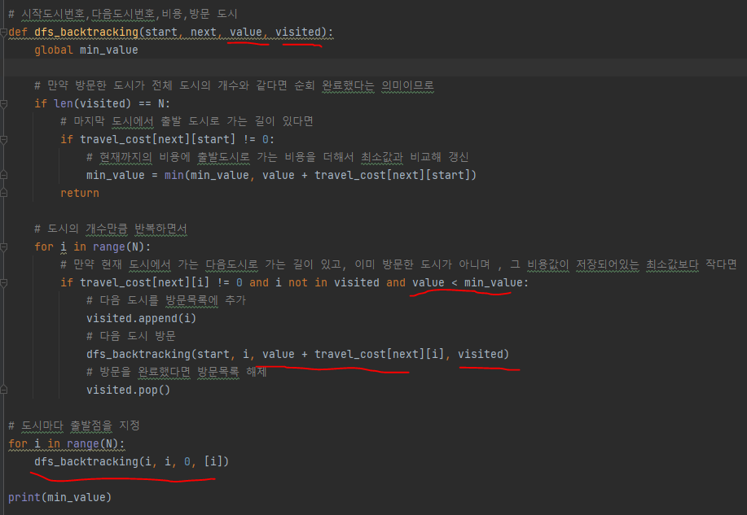

# 문제 유형
- 백트래킹
  - DFS를 돌면서 방문여부와 비용값을 비교하면서 굳이 모든 경로를 탐색하지 않는 방법 
- 완전탐색
  - 어느도시에서 시작하든 순회가능이 보장되어있기 때문에 시작도시를 하나로 고정하고 permutation을 사용해 갈 수 있는 경로 순열을 만들어 완전탐색해 최소 비용 경로 구하는 방법

# 중요 코드 개념
- 백트래킹
  
  

# 시간복잡도
