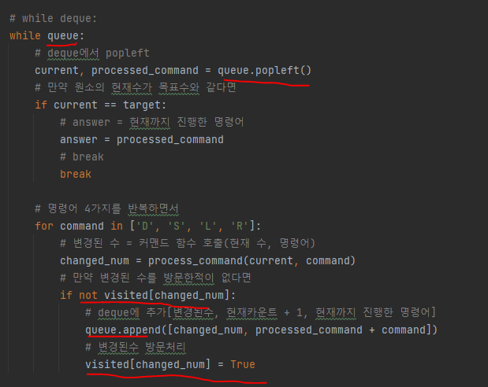

# 문제 유형
- 완전탐색
  - BFS
    - A에서 B로 변환하기 위해 필요한 최소한의 명령어 나열 출력하는 문제이므로, 명령어 나열에 대해 완전탐색 하는 문제
    - 최소한의 명령어 나열을 찾는 문제이므로 BFS로 풀어야함

# 주요 코드 개념
- BFS로 완전탐색 진행

  

- 왼쪽회전, 오른쪽회전 진행시 문자열 이용하지 않고 수 계산 진행해야 시간초과 안남

  

# 시간복잡도