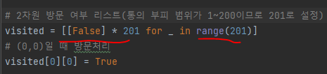
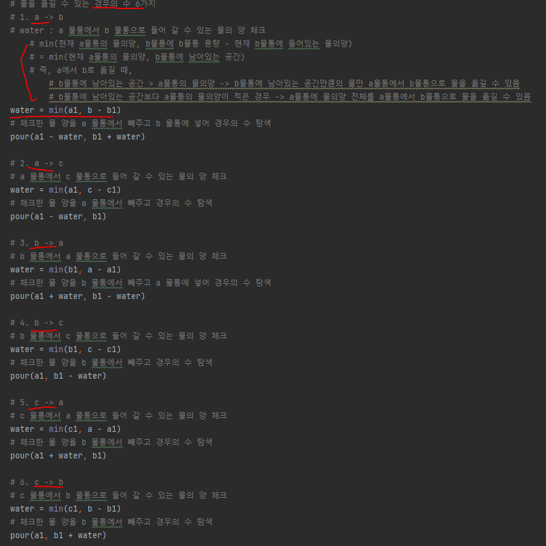
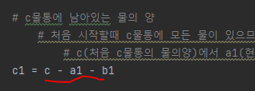
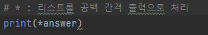

# 문제 유형
- 완전탐색
  - BFS
    - A물통이 비어있을 때, C물통에 담겨있는 물의 양의 종류를 모두 구하는 문제이므로, 물을 옮기는 경우의 수를 완전탐색하는 문제
  
# 주요 코드 개념
- 2차원 방문여부 리스트
  - a물통 양과 b물통의 양을 경우의수로 탐색하므로 2차원 방문 여부 리스트를 사용
    
    

- 물을 옮길 수 있는 경우의 수 6가지를 확인하며 bfs 진행
  - water의 의미
    - a 물통에서 b 물통으로 들어 갈 수 있는 물의 양 체크

        

- c1 의미
  - c물통에 남아있는 물의 양 
    - 처음 시작할때 c물통에 모든 물이 있으므로, c(처음 c물통의 물의양)에서 a1(현재 a물통의 물의 양)과 b1(현재 b물통의 물의양)을 빼면, c1(현재 c물통에 남아있는 물의양)을 알 수 있음

    

- 파이썬 *(asterisk)로 list unpacking해서 공백 간격으로 list요소 출력

    

# 시간복잡도