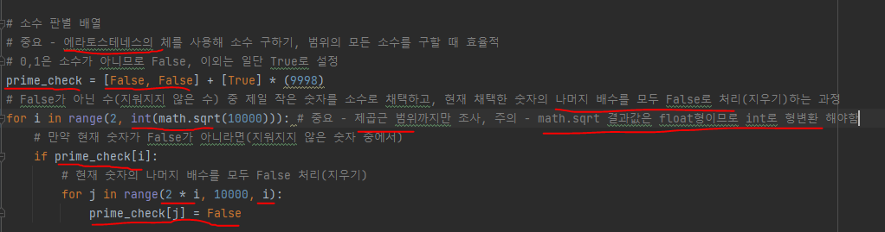
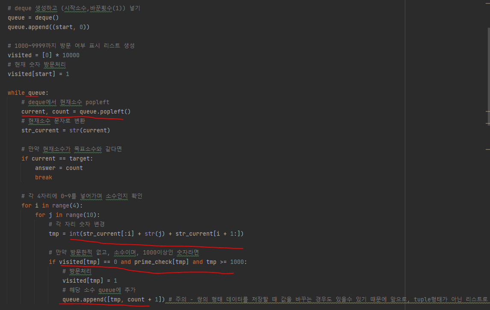
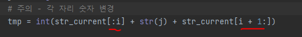
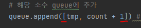
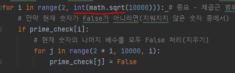

# 문제 유형
- 완전 탐색
  - BFS
    - 주어진 두 소수 사이의 변환에 필요한 최소 횟수를 구하는 문제이므로, 1000~9999 범위의 소수를 구한 뒤 완전탐색 해야함
    - 최소 횟수를 구하는 문제이므로 bfs 사용

# 주요 코드 개념
- 미리 1000~9999까지의 숫자에 대해 소수인지를 판별하는 리스트 만들기
  - 소수구할 때, "에라토스테네스의 체" 방법 사용하기
  
    
  
- bfs 사용해 완전탐색

  

# 주의 코드 개념
- 각 자리 숫자 변경 방법

  

- 쌍 형태 데이터 저장할 때 튜플아닌 리스트로 받기

  

- math.sqrt 결과값 float이므로 int로 형변환 

  

# 시간복잡도