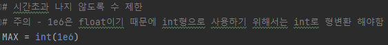
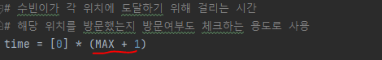
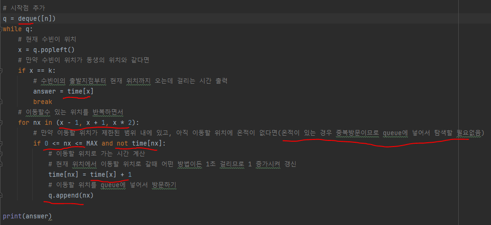
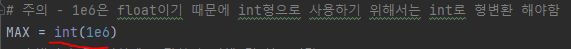
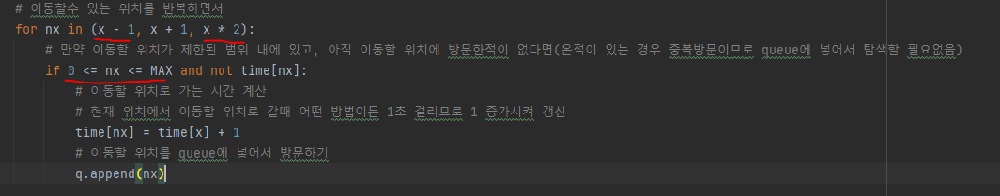

# 문제 유형
- 완전탐색
  - BFS
    - 3가지 이동 방법에 따라 위치를 이동하면서 완전탐색하는 문제
    - 이미 방문한 위치에 대해서 해당 위치까지 시간이 얼마나 걸리는지 다시 계산하면 시간초과 나므로 BFS 사용

# 주요 코드 개념
- 시간초과 나지 않도록 수 제한 

  

- 수빈이가 각 위치에 도달하기 위해 걸리는 시간 및 해당 위치 방문여부 체크

  

- BFS를 deque로 구현 

    

# 주의 코드 개념
- 1e6은 float이기 때문에 int형으로 사용하기 위해서는 int로 형변환 해야함
  
  

- 이동할 위치가 제한 범위 내에 있는지 확인해야함(음수위치로 가거나 너무 멀리 벗어나는 것을 방지)

  

# 시간복잡도
- O(N)
  - 방문처리를 해서 한 번 방문한 곳은 방문하지 않고, deque의 push,pop 연산 시간복잡도는 O(1)이므로
  - 시간 제한 : 2초
    - n(방문해야하는 지점의 수)가 최대 100,000
    - O(N) 이내의 시간복잡도 필요
