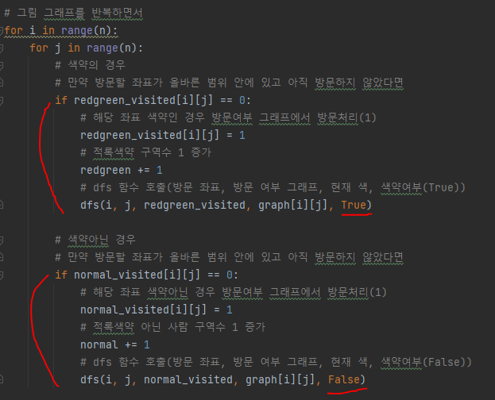
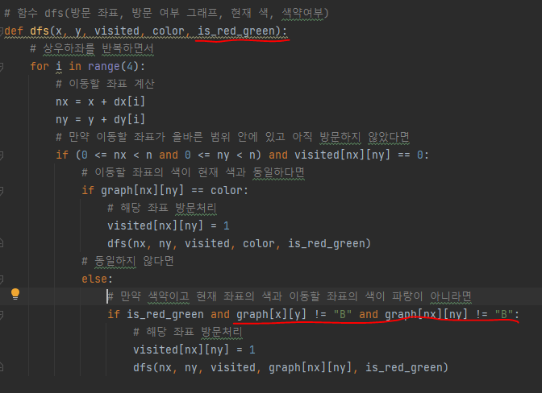
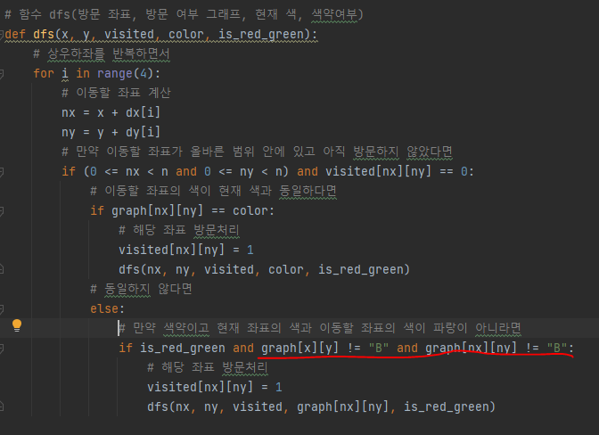

# 문제 유형
- DFS or BFS
  - 상하좌우로 인접한 구역을 같은 구역으로 판단하고 구역의 개수를 세는 문제이기 때문에 DFS 또는 BFS 사용

# 주요 코드 개념
- 색약인 경우와 색약이 아닌 경우로 방문 그래프를 나누어 처리

  

  

# 주의 코드 개념
- 색약의 경우 빨강과 녹색을 동일하게 처리하는 경우 주의

  

- 다시 풀때 헷갈리는게 2가지 있는데 해결방법
  - 하나의 dfs함수로 어떻게 색약 사람과 아닌 사람을 구분해 처리할지
    - dfs 매개변수에 아예 리스트 넘겨주면서
      - 메모리 문제가 있을 것이라 생각했지만 n 범위가 크지 않아 괜찮은듯
  - 방문여부 변수 따로 만들지 안만들지
    - 방문여부 변수 따로 만들 필요없이 이미 방문한 곳은 0으롭 변경해 방문구분

# 시간복잡도