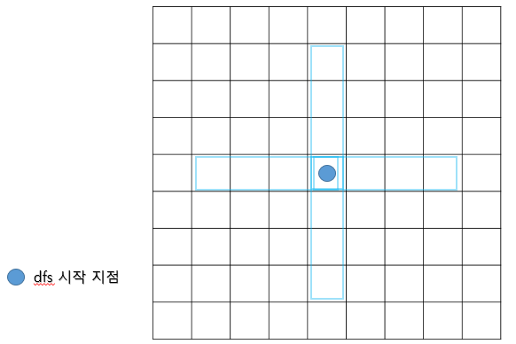
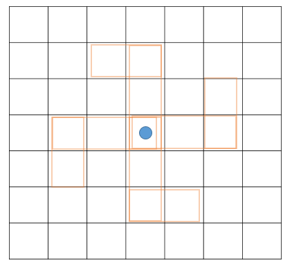
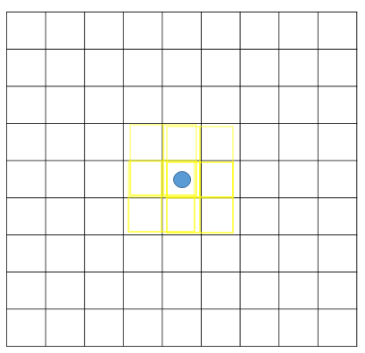
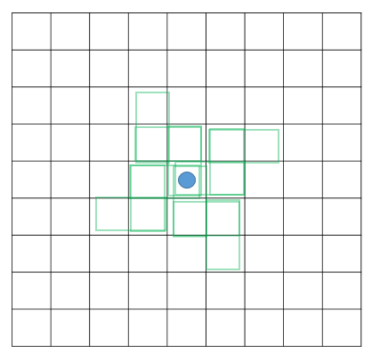
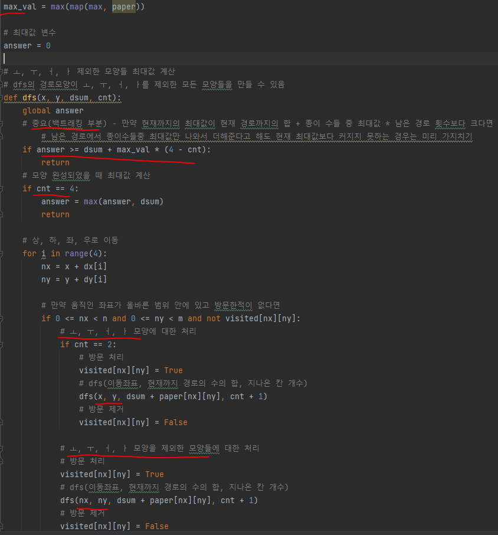
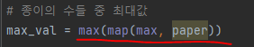

# 문제 유형
- 구현
  - DFS
    - DFS로 지나가는 경로를 통해 테트로미노의 회전과 대칭 모양을 모두 만들 수 있음

      

      

      

      
    
  - 백트래킹
    - 모든 경로를 탐색하면 시간이 오래걸리므로 가지치기를 위해 사용

# 주요 코드 개념
- DFS의 경로를 통해 테트로미노의 회전과 대칭 모양들 만들 수 있으므로 DFS 경로의 합을 계산해서 수의 최대값 계산
  - 모든 경로 탐색하지 않기 위해 남은 경로에서 종이수들중 최대값만 나와서 더해준다고 해도 현재 최대값보다 커지지 못하는 경우는 미리 가지치기

  

# 주의 코드 개념
- 2차원 배열의 최대값 계산방법

  

# 시간복잡도