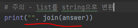

# 문제 유형
- 완전탐색
  - 백트래킹
    - 주어진 알파벳들을 사용해 암호를 만들어 탐색하며 조건에 맞는 암호들을 찾는 문제이므로 완전탐색
    - 탐색 도중 조건에 맞지 않는 암호들은 탐색을 중단해야하므로 백트래킹 사용 

# 주요 코드 개념
- 백트래킹 구현
  - stack으로 구현한 DFS 방식으로 탐색하면서 주어진 조건에 따라 탐색 중단을 하는 방식으로 구현
  
    

# 주의 코드 개념
- 공백으로 구분된 문자를 list형으로 받는 경우
  
  

- list를 string으로 변환 

  