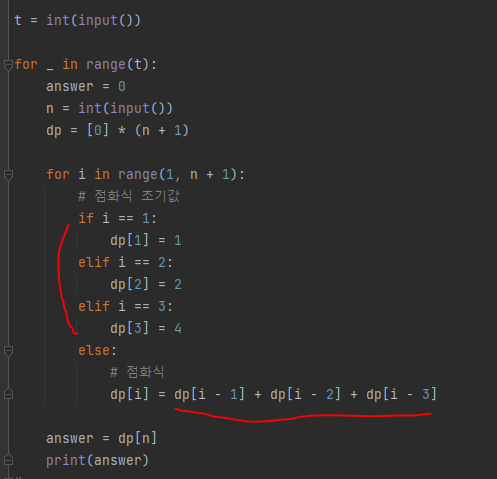
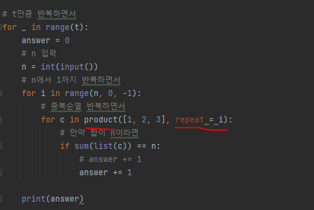

# 문제 유형
- 완전탐색
  - 정수 n을 1,2,3의 합으로 나타내는 방법의 수를 구하는 문제이므로 1,2,3으로 만들 수 있는 중복순열(product, 같은 숫자 여러번 사용가능)을 완전탐색하는 문제
  - 중복순열(product)
- DP
  - 만들 수 있는 방법의 수에 일정한 규칙이 있으므로 이를 점화식으로 표현해 해결  
# 주요 코드 개념
- DP
  - 초기값
  - 점화식

    

# 주의 코드 개념
- 중복순열로 풀때 중복순열 라이브러리 사용법

    

# 시간복잡도