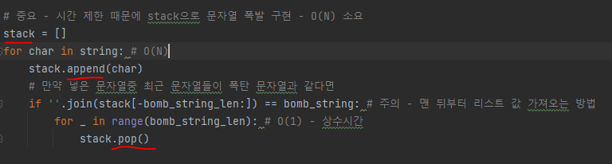
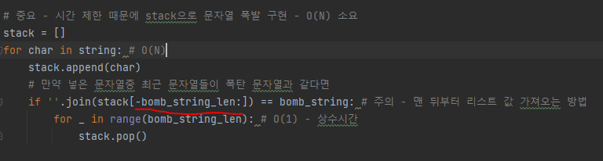
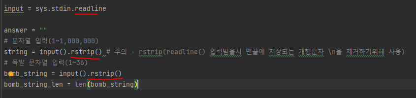

# 문제 유형
- 문자열
- stack
  - 일반 문자열 함수시 발생하는 시간초과를 방지하기 위해 사용
  
# 주요 코드 개념
- 문자열 입력과 제거시 stack 사용
  - 문자열 함수를 사용해 문자열 추가와 제거시 시간초과 발생
  - stack 사용시, push, pop 모두 O(1)이므로 시간초과 해결 가능

    

- 맨 뒤부터 리스트 값 가져오는 방법

    

# 주의 코드 개념
- readline()으로 입력받을 시 rstrip 무조건 하기

  

# 시간복잡도
- O(N)
  - 범위가 다음과 같으므로, O(N)의 시간복잡도를 알고리즘으로 구현해야함
    - 입력 문자열의 범위 : 1~1,000,000
    - 폭발 문자열의 범위 : 1~36
  - 일반 문자열 함수 사용시, 시간초과  
  - stack 사용
    - 문자열을 추가, 제거하는 시간을 O(1)로 구현해야 하기 때문에 stack 사용
  
    