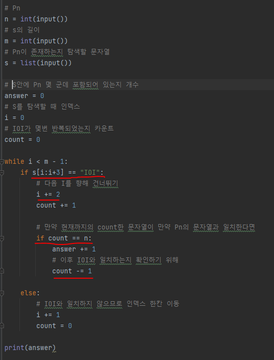

# 문제유형
- 문자열 

# 주요 코드 개념
- 모든 S를 한칸씩 거치면서 탐색할경우 시간초과가 발생하므로, IOI 개수를 체크하는 방식으로 "IOI"를 발견했다면 2칸씩 건너띄는 방식으로 구현해야함 

        

# 시간복잡도
- O(N)
  - 서브테스크 2의 경우 1000000 * 1000000 이므로 이를 통과하기 위해, O(N) 또는 O(NlogN)의 시간복잡도를 가지게 설계해야함
    - IOI가 몇번 연속되는지 개수만 찾아서 체크하는 방식으로 O(N*3) 정도의 코드로 작성