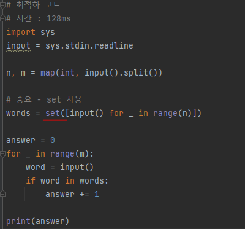

# 문제 유형
- 문자열

# 주요 코드 개념
- list를 사용하면 시간초과 나므로 대신 set 사용 
  - set, dict 같은 hash table 구조(key에 데이터를 저장하는 구조, key를 통해 데이터를 받아오기 때문에 빠름)를 사용
    - set은 key, dict는 key와 value가 있음
  - 이러한 hash는 hashing function(key에 대한 산술 연산을 통해 데이터의 위치를 찾는 함수)을 이용하므로
    - O(1)에서 최악의 경우 O(n)의 시간 복잡도(해시값 충돌이 일어날 경우) 갖음
  
    

# 시간복잡도
- O(n)
  - 여기서 시간복잡도에 영향을 미치는 것은 n(집합 문자열 개수), m(검사할 문자열 개수)인데
    - n * m 
      - O(n) * O(1)
        - m이 n에 있는지 검사할 때 set을 사용했기 때문에 검사에 O(1)이 소요됨