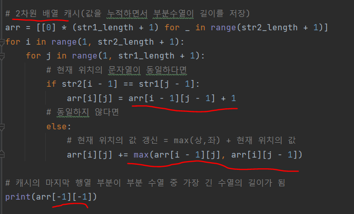
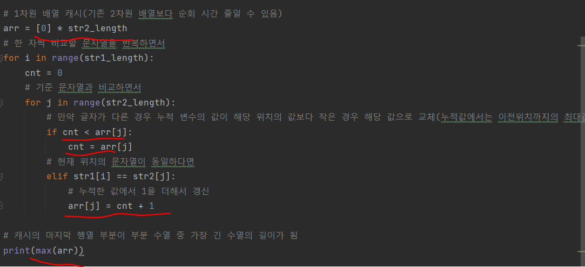

# 문제 유형
- 문자열
- Dynamic Programming

# 주요 코드 개념
- 동적계획법 cache
  - 2차원 배열 cache 방식
    - 내가 짠 코드는 두 문자열 중 한 문자열의 길이 1인 경우에는 틀린 코드 였음 

      

  - 1차원 배열 cache 방식
    
      

# 시간복잡도 
- 1차원 배열 cache 방식 사용하면 2차원 대신 1차원만 순회하면됨 
  - 시간 절반으로 단축
