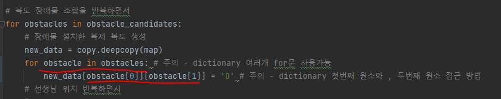

# 문제 유형
- DFS
  - 중복 조합 
    - 장애물 3개 설치하는 모든 경우를 조합하여 학생이 감시로부터 피하도록 할 수 있는지 여부를 구하는 완전탐색 문제이기 때문
  
# 주요 코드 개념
- 경우 조합은 파이썬 라이브러리로 구현

  
  
- 선생님의 4방향 감시를 DFS로 구현 
  
  

# 주의 코드 개념

- dictionary 여러개에 대해 for문 사용가능
- dictionary의 첫번째 원소, 두번째 원소 접근 방법

  

# 시간복잡도