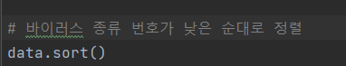
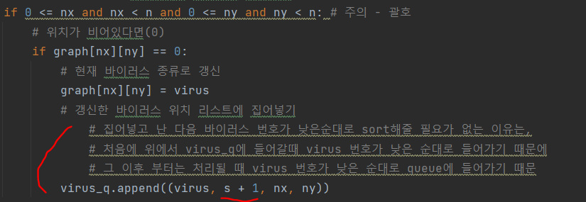
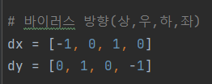
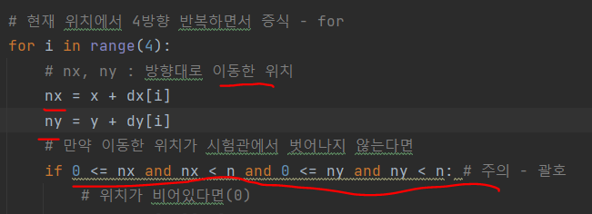
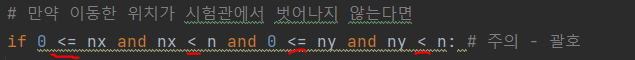

# 문제 유형
- BFS
  - 매초마다 상하좌우로 일정하게 증식하는 바이러스들을 구현하는 문제이기 때문

# 주요 코드 개념
- 바이러스 종류 번호가 낮은 순대로 정렬

  

- 갱신한 바이러스 위치 리스트에 넣기
  - 위에서 바이러스 종류 번호가 낮은 순대로 정렬해주었기 때문에 그 이후 queue에 들어갈 때는 같은 초 내에서는 virus가 번호가 낮은 순대로 처리되는 것을 보장
  
  

- 바이러스가 이동한 위치

  
  

# 주의 코드 
- 이동한 위치 범위에서 벗어났는지 확인할 때 비교괄호 주의 
  

# 시간 복잡도 