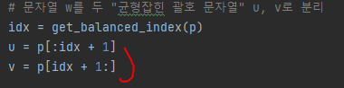
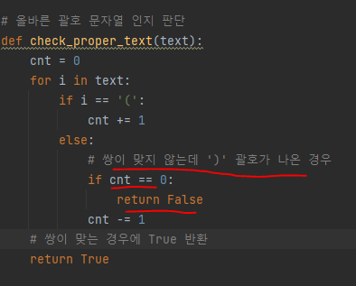
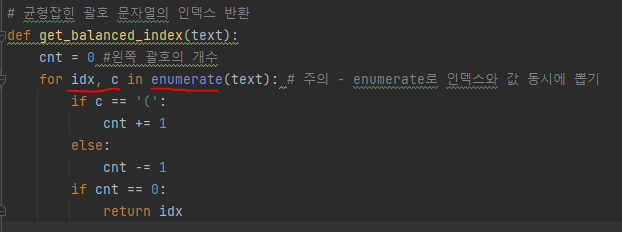
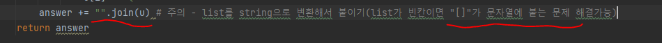

# 문제 유형
- 구현
- 재귀함수(DFS느낌)
  - solution 함수를 재귀 호출하는 문제이기 때문

# 주요 코드 개념
- 문자 분리 
    
  

- 올바른 괄호 문자열인지 판단하는 함수 
  - '('가 와의 쌍이 맞지 않는 상황에서 ')'이 나오는 경우를 고려해서 구현하면됨
    
  
  
# 주의 코드 개념
- enumerate 사용

  

- 빈 list를 빈 문자열로 변환시 방법

  

# 시간 복잡도
