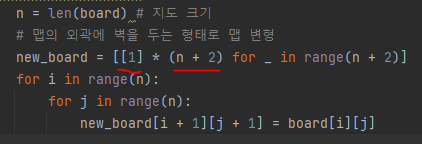
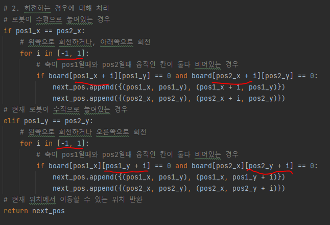
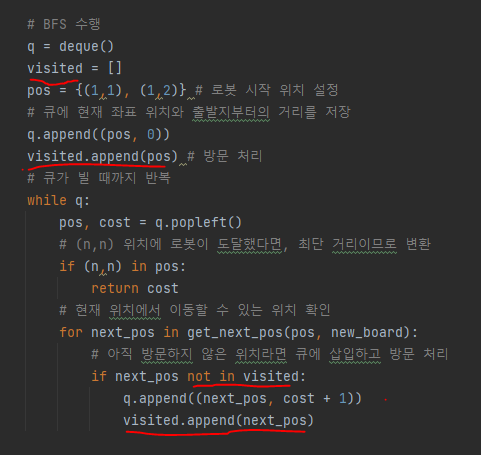

# 문제 유형 
- BFS
  - 로봇을 n,n 위치로 옮기는 최단 거리를 계산하는 문제이기 때문 

# 주요 코드 개념
- 로봇이 맵에서 벗어나는 것을 쉽게 확인하기 위해 맵의 외곽에 벽을 두는 형태로 맵 변형
  
  

- 회전 이동하는 경우 처리 
  - 로봇이 수평인 경우와 수직인 경우로 나눠서 처리 
    - 로봇의 두 좌표중 어느쪽이 축인지 경우를 상관하지 않아도 되는것이 예를 들어 수평으로 놓여있을 때 위쪽으로 회전하는 경우 축이 어느 좌표이든 같은 위치로 이동하게 됨 
    - 어차피 이동할 수 있는 위치를 구하면 되기 때문에 어느쪽이 축이여도 동일한 위치라 상관없음  
  
      
  

# 주의 코드 개념
- bfs 구현시 방문한 곳을 확인하는 visited 리스트 사용

  
  

# 시간 복잡도 