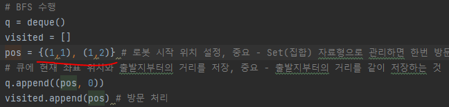
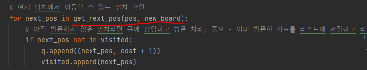
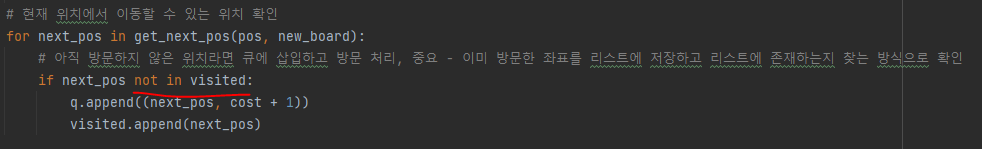

# 문제 유형 
- BFS
  - 로봇을 n,n 위치로 옮기는 최단 거리를 계산하는 문제이기 때문 

# 주요 코드 개념
- 로봇이 맵에서 벗어나는 것을 쉽게 확인하기 위해 맵의 외곽에 벽을 두는 형태로 맵 변형
  
  

- 로봇 위치를 Set(집합) 자료형으로 관리

  

- 현재 위치에서 이동할 수 있는 위치를 반환하는 함수 

  

  - 회전 이동하는 경우 처리 
    - 로봇이 수평인 경우와 수직인 경우로 나눠서 처리 

        
  
- 아직 방문하지 않은 위치라면 큐에 삽입하고 방문 처리

  

# 주의 코드 개념
- bfs 구현시 방문한 곳을 확인하는 visited 리스트 사용

  

# 시간 복잡도 