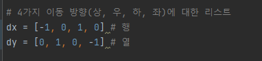

# 문제 유형(깊이우선탐색)
  - DFS(깊이우선탐색)
    - 벽을 3개 설치하는 모든 경우의 수를 계산해야 하기 때문에  DFS 또는 BFS 또는 파이썬의 조합 라이브러리 이용해야함
    - 벽의 개수 3개를 조합하는 것과 안전 영역 크기 계산할 때 모두 DFS 사용 
  - 구현이 까다롭기 때문에 구현 문제로도 분류 가능 

# 주요 코드 개념
- 파이썬 조합 함수 대신 DFS를 통해 벽의 조합 계산

- DFS를 이용해 바이러스가 사방으로 퍼지도록 하기

- 현재 맵에서 안전 영역 크기 계산

# 주의 코드 개념
- 코딩할 때는 가로,세로 개념이 아니라 x는 행 y는 열이라고 생각하기
  - 다른 코드 작성할때도 헷갈리지 않게 무조건 행,열 순으로 작성

# 시간 복잡도 
