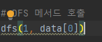

# 문제 유형
- DFS or BFS
  - 연산자를 삽입하는 모든 경우의 수를 계산하기 위해(완전탐색)
  - DFS 대신 중복 순열 라이브러리 이용 가능

# 주요 코드 개념
- 중복 순열을 DFS 방식으로 구현
  - 연산자를 기호로 바꿀 필요없이 연산자 횟수 빼고 더하는 식으로 연산자 사용하는 것 구현
  
    
  

# 주의 코드 개념 
- 매우 큰 숫자 표기 방식 
  - 10억 = 1e9(0의 개수 적기)

# 시간 복잡도 
- DFS 방식이 중복 순열 조합 방식보다 빠른듯
    