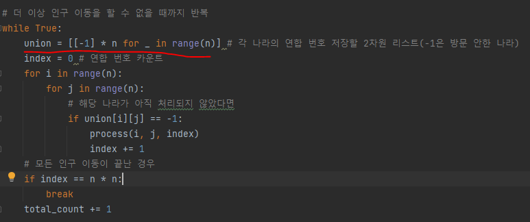
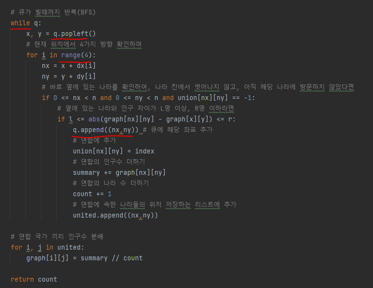
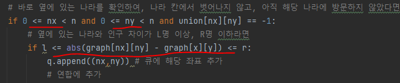

# 문제 유형
- DFS or BFS
  - 모든 나라의 위치에서 상,하,좌,우로 국경선을 열 수 있는지를 확인해야 하기 때문

# 주요 코드 개념
- 각 나라의 연합 번호를 저장할 2차원 리스트 생성
  - 방문 안한 나라는 -1로 표시 
  
  

- 현재 나라 기준으로 상하좌우 나라의 국경선을 열 수 있는지를 확인하는 것을 BFS를 통해 구현
    
  

# 주의 코드 개념 
- x보다 크고 y보다 작다 라는 조건 작성 시 밑과 같이 더 짧게 작성가능

  

# 시간 복잡도 