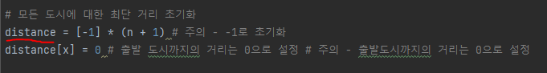

# 문제 개념 
- BFS
  - 최단거리를 찾아야 하는 문제이고 모든 도로의 거리는 1이라는 조건 때문에 BFS를 이용해 해결 가능

# 주요 코드 개념 
- 출발지부터 모든 도시에 대한 최단 거리를 저장하는 리스트

  

- BFS 수행하면서 최단 거리 갱신

  

# 주의 코드 개념 
- 모든 도시에 대한 최단 거리 리스트에서 처음에 -1로 초기화
- 출발 도시까지의 거리는 0으로 설정

  

- 최단 거리 도시번호를 저장하는 변수없이 check 변수를 사용해 출력 가능
  
- 

# 시간 복잡도 
- O(N + M)
  - N : 도시 개수
  - M : 도로 개수 
