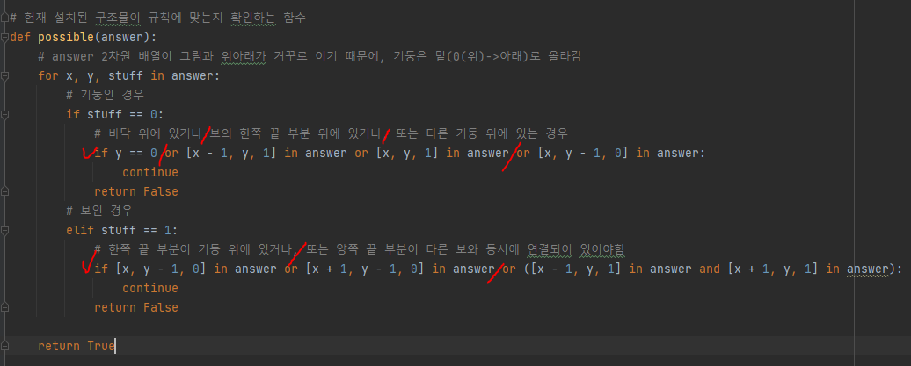
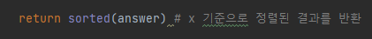
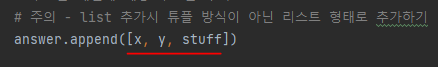
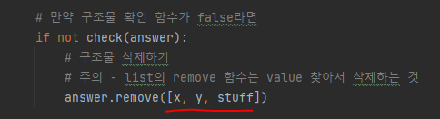
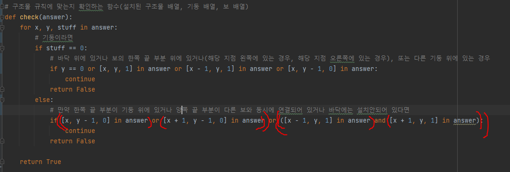
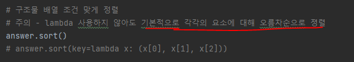

# 문제 유형
- 구현
  - 시뮬레이션

# 주요 코드 개념
- 문제에서 주어진 그림과 answer 2차원 배열은 위아래가 거꾸로 이기 때문에, answer 배열에서는 위로 올라갈시 기둥이 밑(0(위)-> 아래)로 올라감
  - 가로 방향은 동일
- 현재 설치된 구조물이 규칙에 맞는지 확인하는 함수
  
  
- 이차원 리스트 정렬 시 default로 요소의 가장 첫번째 인덱스의 요소를 기준으로 정렬

  

# 주의 코드 개념
- list 사용법
  - 튜플 방식이 아닌 리스트 형태로 추가

    

  - remove 함수는 value 찾아서 삭제하는 것

    

- 연산자 우선순위
  - in > and > or

        

- 정렬 
  
    

  

# 시간 복잡도
- O(N^3)
  - n : 설치 벽 크기 
  - for 설치 작업 반복 
    - for 설치 구조물 반복
      - for 설치 구조물 반복(규칙에 맞는지 확인시) 