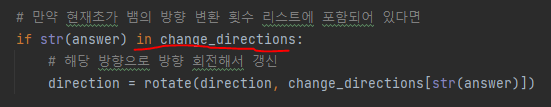

# 문제 유형 
- 구현(시뮬레이션)

# 주요 코드 개념
- 방향 이동을 위한 변수

    

- 뱀 차지하고 있는 위치 정보를 튜플 데이터로 리스트에 저장

    

- 뱀 머리 회전하는 함수
  - 나머지를 구하는 방식으로 회전했을 때의 방향 구하기
  - -1/4과 같이 나누는 수 가 마이너스인 경우 3이 나오는 방식으로 계산되기 때문에 이렇게 구현  
    

# 주의 코드 개념 
- 뱀 좌표 저장에 queue를 사용
  - 나중에 뱀 꼬리 좌표를 알아낼 때 유용

    

  - list에서 pop할 때 0으로 인덱스 지정해야 맨 앞꺼 나옴

    

- 뱀 머리 회전 함수
  
  

- Dictionary 사용 방법
  - 선언

    
  
  - dictionary의 keys에서 해당하는 값 찾기 
    
    

- 단순히 입력을 공백단위로 문자열로 구분할 때는 input().split() 사용

  

# 시간 복잡도