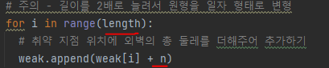
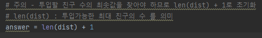

# 문제 유형
- 구현
  - 완전탐색
    - 주어진 데이터의 개수(weak 리스트와 dist 리스트의 길이)가 매우 작기 때문에 모든 경우를 일일이 확인하는 완전 탐색으로 접근 가능

# 주요 코드 개념
- 원형 형태의 경우 일자 형태의 배열을 2배로 늘린 형태로 만들면 구현하기 편함

    

- 투입할 친구의 순서의 조합을 생성하기 위해 permutations 함수(순서 상관 있음) 사용

# 주의 코드 개념
- 길이를 2배로 늘려서 원형을 일자 형태로 변형

  

- 투입할 친구의 최소값 초기화

  

# 시간복잡도
