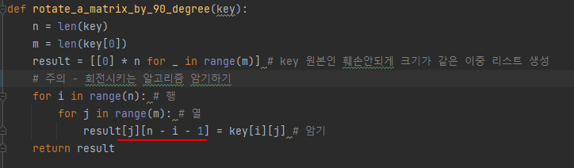

# 문제 유형
- 구현
  - 완전탐색
- 시뮬레이션

# 주요 코드 개념
- 자물쇠의 크기를 기존의 3배로 변경 

- 자물쇠 회전 함수

- 자물쇠에 열쇠를 끼워넣기 

- 자물쇠에 열쇠를 끼워넣는 것이 맞는지 검사하는 함수 

# 주의 코드 개념
- 회전 알고리즘 암기하기

    

- 열쇠이동시 확장된 자물쇠 부분의 끝부분 인덱스까지 확인안하는 이유

    

# 시간복잡도 