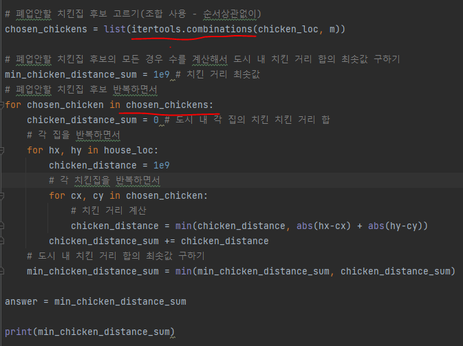
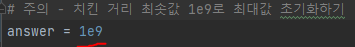

# 문제 유형
- 구현

# 주요 코드 개념
- 폐업안할 치킨집 후보를 조합(combination)으로 골라서 최소 치킨 거리 합을 구함
  - python의 itertools.combinations 사용
  
    

# 주의 코드 개념
- itertools : 순열(순서 상관), combinations : 조합(순서 없음)
- 최대값 초기화 방법

  

# 시간 복잡도